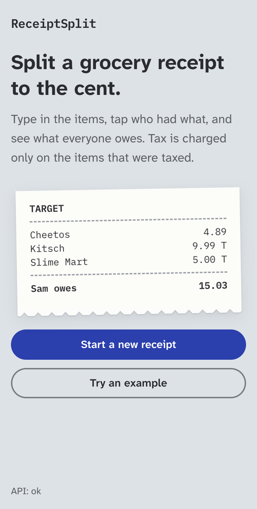
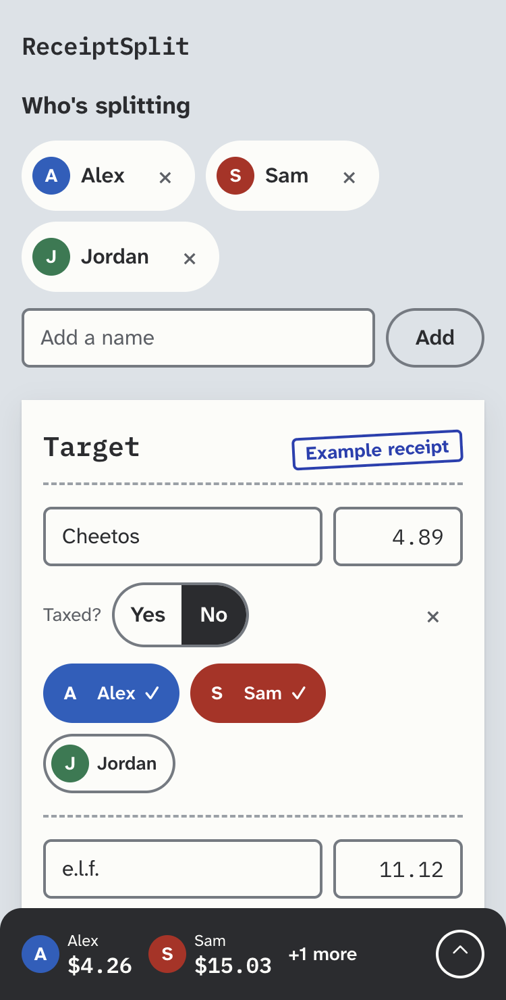
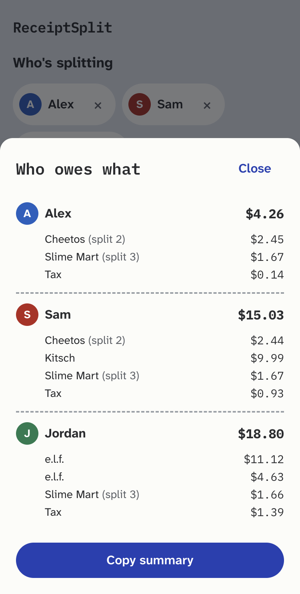

# ReceiptSplit

Split a shared grocery receipt to the cent: add who's splitting, tag who had each item, and get
exact per-person totals, with tax charged only on the items that were actually taxed.

**Try it:** https://receiptsplit-beta.vercel.app, then tap **Try an example**. Works best on a phone.

<p>
  <picture>
    <source media="(prefers-color-scheme: dark)" srcset="docs/images/start-dark.png">
    
  </picture>
  <picture>
    <source media="(prefers-color-scheme: dark)" srcset="docs/images/receipt-dark.png">
    
  </picture>
  <picture>
    <source media="(prefers-color-scheme: dark)" srcset="docs/images/totals-dark.png">
    
  </picture>
</p>

> **No sign-up, no saved people, no receipt history.** A receipt lives on the server for an hour
> until you first edit it, then 24 hours after your last edit, and is then deleted.

## Why

Splitting a grocery run "proportionally" is wrong in places like New York, where most groceries
are tax-exempt but soda and household goods are taxed. If one roommate buys $60 of produce and
another buys $20 of soda, a proportional split charges the produce buyer tax on items that were
never taxed. ReceiptSplit charges each taxed line's tax only to the people who had that line, in
integer cents, and every share sums exactly to the receipt.

## What works today

- **Manual entry:** type items, prices and the printed tax; mark each item taxed or not.
- **Tagging:** tap everyone who shared an item; shared items split evenly, remainders included.
- **Exact totals:** a sticky bar shows what everyone owes; the sheet breaks it down per person and
  copies a plain-text summary for the group chat.
- **Autosave:** edits save in the background with retry and backoff; offline edits are kept.
- **Next:** photo capture and AI parsing of the receipt into the same screen
  ([slice plan](docs/design/v0-architecture-and-slice-1.md)).

## How it works

```
web (Next.js 16, Vercel) ──HTTP/JSON──▶ api (FastAPI, Railway) ──▶ PostgreSQL 18 (Railway)
                                         ▲
                       purge (Railway cron, hourly) ── deletes expired receipts
```

- **Money is a pure, tested domain.** `api/app/domain/` has no framework or database code. It
  allocates in integer cents with largest-remainder rounding and spreads each tax amount only over
  the taxed lines' owners. Hypothesis property tests check that shares always sum exactly to the
  receipt and never go negative.
- **One contract, two languages.** The web app's API types are generated from the backend's
  OpenAPI schema, and CI fails if they drift.
- **Ephemeral by design.** A receipt is one row (items, people and tags as validated JSON). An
  hourly cron and every create purge expired rows. Per-IP token-bucket rate limits and a request
  size cap protect the endpoints, since there are no accounts.
- **Safe deploys.** Migrations are hand-written and run before each deploy while the old version
  still serves (expand → deploy → contract). `/readyz` fails unless the database schema matches
  the code, so a deploy whose migration didn't run never goes live.
- **The save loop is a tested state machine.** Debounce, at most one request in flight, retry with
  backoff, a pause on rate limits, and recovery when a receipt expires mid-edit (the edits move to
  a new receipt instead of being lost).
- **Accessible.** WCAG 2.2 AA: a test reads the theme's real colour tokens and checks every text,
  border and focus-ring contrast pair in light and dark; people are never told apart by colour
  alone; controls are at least 44 px.

## Stack

| Layer | Versions |
|---|---|
| Web | Next.js 16.3.5, React 19.2.8, TypeScript 5, Tailwind 4, Vitest 5, Node 24 |
| API | Python 3.13, FastAPI 0.141, SQLAlchemy 2.0.53, Alembic 1.20, pydantic 2.13, uv 0.9.7 |
| Database | PostgreSQL 18 |

## Local development

Prerequisites: Homebrew, [uv](https://docs.astral.sh/uv/) 0.9.7, [nvm](https://github.com/nvm-sh/nvm).

1. **Database**
   ```sh
   brew install postgresql@18 && brew services start postgresql@18
   createdb receipt_splitter
   createdb receipt_splitter_test
   ```
   (Stop any other Postgres running on port 5432 first.)
2. **Node**: `nvm install 24 && nvm use` (reads `.nvmrc`; the web tests need Node 24).
3. **API**
   ```sh
   cd api
   cp .env.example .env
   uv sync
   uv run alembic upgrade head
   uv run uvicorn app.main:app --reload --port 8000
   ```
4. **Web**
   ```sh
   cd web
   cp .env.example .env.local
   npm install
   npm run dev
   ```
   Open http://localhost:3000 and tap **Try an example**. The footer should say `API: ok`.

## Tests and checks

```sh
# API (loads api/.env, so DATABASE_URL_TEST is picked up)
cd api
uv run ruff check . && uv run ruff format --check . && uv run mypy app
REQUIRE_DB_TESTS=1 uv run pytest

# Web
cd web
npm run lint && npm run format:check && npm run typecheck && npm test && npm run build
```

After changing API routes or models, regenerate the frontend types and commit both files:

```sh
cd api && uv run python -m app.scripts.export_openapi
cd ../web && npm run gen:api
```

CI (`.github/workflows/ci.yml`) runs all of these on every push to `main`.

## Deployment

| Service | Where | Notes |
|---|---|---|
| Web | Vercel, root `web/` | `NEXT_PUBLIC_API_BASE_URL` points at the API |
| API | Railway, root `api/`, config `api/railway.toml` | Pre-deploy `alembic upgrade head`; healthcheck `/readyz` |
| Purge | Railway cron, config `api/railway.cron.toml` | Hourly; deletes expired receipts |
| Database | Railway PostgreSQL 18 | |

## Design docs

- [v0 architecture and slice plan](docs/design/v0-architecture-and-slice-1.md)
- [Slice 3: manual-entry splitting](docs/design/slice-3-manual-split.md)
